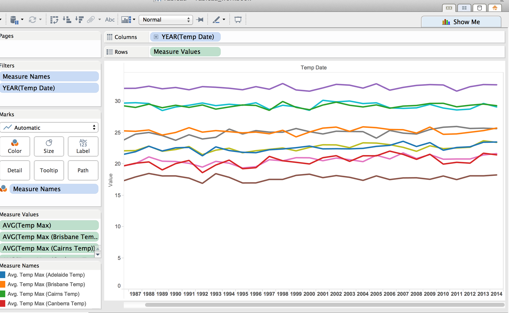
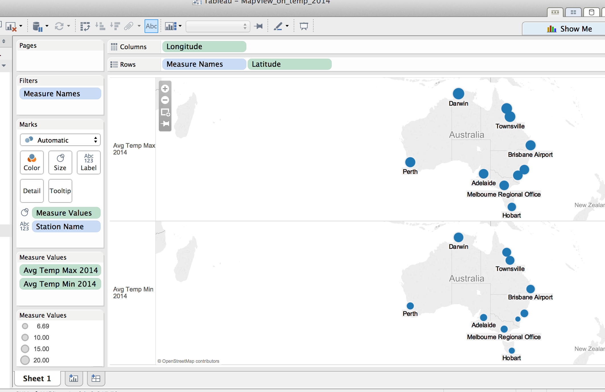
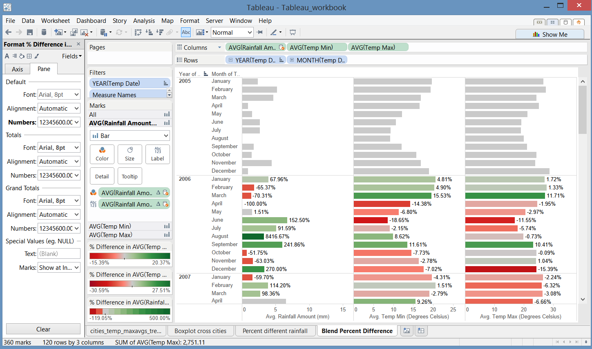

Our Final Project was created to demonstrate materials and tools learned over the spring semester. This html document has been broken down into different sections to better understand the overall analysis of our final project.

All project materials can be downloaded or pulled from our [GitHub](https://github.com/JiannanZhang/DV_FinalProject) repository. 

##__1. Datasource__

The Bureau of Meteorology (BOM) is Australia's national weather, climate, and water agency. They provide weather information to all states within Australia. All rain data sets were provided through BOM's [Climate Data Online](http://www.bom.gov.au/jsp/ncc/cdio/weatherData/av?p_nccObsCode=136&p_display_type=dailyDataFile&p_startYear=2013&p_c=-872859776&p_stn_num=066062). This source gave us access to select weather stations and download all available rainfall information. In regards to temperature, which was also taken from the BOM website, was directly provided from the [Australian Climate Observations Reference Network – Surface Air Temperature](http://www.bom.gov.au/climate/change/acorn-sat/#tabs=Data-&-network). The temperature dataset provides information on the maximum and minimum temperature for every day of a recorded year for a particular city. 


Because there were too many cities to focus on, we decided to pick the top ten most recognized cities in Australia with locations varying across the country:
 
**City Name**      **Population**
----------------   --------------------
Adelaide (SA)      1,212,982
Brisbane (QLD)  	 2,074,222
Cairns (QLD)	     153,075
Canberra (NSW)	   417,860
Darwin (NT)	       128,073
Hobart (TAS)	     216,656
Melbourne (VIC)    4137,432
Perth (WA)	       1,738,807
Sydney (NSW)	     4,627,345
Townsville (QLD)   176,327


##__2. Cleaning and Transforming Datasets__

Appropriate datasets were downloaded from the BOM website for temperature and rainfall. We noticed that in order to proceed with our analysis, reformatting the data was a must. With the rainfall data, the removal of illegal characters and changing of the column names for appropriate submission into Orcle was needed. Reformat.R (which was provided in CS 329e) was used to clean this dataset. In addition, the removal of NA was needed. Below represents the SQL query used to replace the NA values with 0.

a. Removing NA from datasets (SQL query)

UPDATE Table Name
SET Column Name = 0
WHERE Column Name = 'NA';

b. Reformat.R was used to clean data from any illegal characters in SQL and change the column names to the correct format. Below provides a before and after visual of the reformatted dataset for Sydney.

Before 


After


We saw that the temperature datasets needed a little more cleaning and joining of data. Jeffrey wrote a python script (called 'txt_to_csv.py' in 01 Data folder) to combine the csv files of minimum and maximum temperature, clean missing values and reformat the date. The following images are examples for city Sydney. In Tableau, we wanted to ensure that the data type date was accessible when using our dataset for analysis, therefore the python script assisted in transforming the strings into data type date. By setting the data type to date for both the rainfall and temperature, it made it easier to blend in Tableau. 

Before 


After 


__Connecting to our datasource__

After cleaning and reformatting the data, tables were created in Orcle and datasets were imported. All datasets for this project can be accessed through Orcle Database:

             Orcle Information
----------  -------------------------------------------
Server       129.152.144.84
Port         1521
Service      ORCL.usuniversi01134.oraclecloud.internal
Username     C##cs329e_jz7674
Password     orcl_jz7674


```{r, include = FALSE}
library(RCurl)
library (ggplot2)
library(extrafont)
library(reshape2)
require("jsonlite")
require(dplyr)
require(tidyr)
require(reshape2)
require(knitr)
```
```{r, include = FALSE}
source("../01 Data/AdelaideRain.R", echo = TRUE)
source("../01 Data/BrisbaneRain.R", echo = TRUE)
source("../01 Data/CairnsRain.R", echo = TRUE)
source("../01 Data/CanberraRain.R", echo = TRUE)
source("../01 Data/DarwinRain.R", echo = TRUE)
source("../01 Data/HobartRain.R", echo = TRUE)
source("../01 Data/MelbourneRain.R", echo = TRUE)
source("../01 Data/PerthRain.R", echo = TRUE)
source("../01 Data/SydneyRain.R", echo = TRUE)
source("../01 Data/TownsvilleRain.R", echo = TRUE)
source("../01 Data/df_Adelaide_temp.R", echo = TRUE)
```


##__3. Data Visualization__

I. Boxplot for a sample city (Adelaide)'s  max temp in recent three years

```{r}
source("../03 Visualizations/box_plot_for_Adelaide.R", echo = TRUE)
```

From the boxplot above, we can see that the median of max temp in 2012 and 2013 is pretty stable. However, in 2014, the median max temp obviously increased a fair amount. Moreover, there are many outliers (about ten) in 2014 whereas in 2012 and 2013, there are none and one outlier respectively.These outliers should draw our attention in the future study.

II. BoxPlot for those ten cities' max temp in 2014

```{r}
source("../03 Visualizations/ten_cities_temp_boxplot.R", echo = TRUE)
```

From the boxplot above, we can see many interesting things. For example, in most cities(except Darwin, Brisbane, Canberra and Perth), all ouliers in each city are gathered on one side. Notice that there are no outliers in Brisbane, Canberra and Perth, which means their temperatures are more "concentrated" than those in other cities. Also notice that Darwin is a hot city over the year (median is about 33) and the max temp range is very small. 

III. Line graph (trend lines) of avg. max temp for those ten cities in recent 30 years.



IV. Geograhphical size plot of avg. max temp and avg. min temp for those ten cities in 2014.



V. Line graph showcasing average rainfall over years for each of the ten cities
```{r}
source("../02 Data Wrangling/City_AVGrain_peryear.R", echo = FALSE)
```
```{r}
source("../02 Data Wrangling/Join_rain_year.R", echo = TRUE)
```

VI. Histogram visualizing the overall sum of the average rainfall for all ten cities
```{r}
source("../02 Data Wrangling/Join_rain_month.R", echo = TRUE)
```

VII. Blended Dataset: Rainfall and Temperature Percent Difference Partitioned by Year and Month
