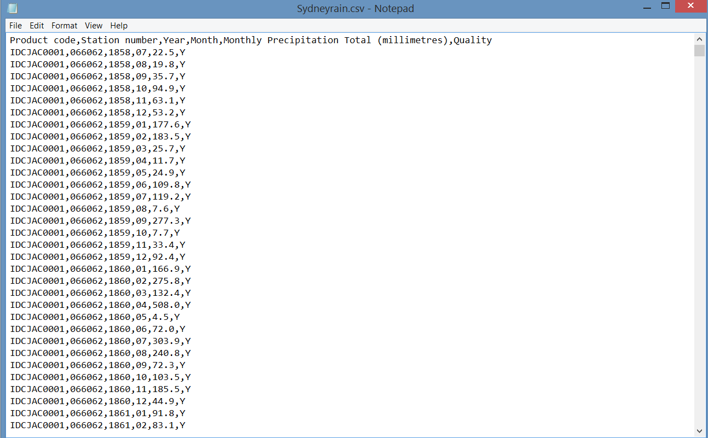

Our Final Project was created to demonstrate materials and tools learned over the spring semester. This html document has been broken down into different parts to better understand the overall analysis.

All project materials can be downloaded or pulled from our [GitHub](https://github.com/JiannanZhang/DV_FinalProject) repository. 

1. Data Source and Data

The Bureau of Meteorology (BOM) is Australia's national weather, climate, and water agency. They provide infofrmation to all states with in Australia.

```{r, include = FALSE}
library(RCurl)
library (ggplot2)
library(extrafont)
library(reshape2)
require("jsonlite")
require(dplyr)
require(tidyr)
require(reshape2)
require(knitr)
```

Data
```{r}
source("../01 Data/AdelaideRain.R", echo = TRUE)
source("../01 Data/BrisbaneRain.R", echo = TRUE)
source("../01 Data/CairnsRain.R", echo = TRUE)
source("../01 Data/CanberraRain.R", echo = TRUE)
source("../01 Data/DarwinRain.R", echo = TRUE)
source("../01 Data/HobartRain.R", echo = TRUE)
source("../01 Data/MelbourneRain.R", echo = TRUE)
source("../01 Data/PerthRain.R", echo = TRUE)
source("../01 Data/SydneyRain.R", echo = TRUE)
source("../01 Data/TownsvilleRain.R", echo = TRUE)

source("../01 Data/df_Adelaide_temp.R", echo = TRUE)
df_Adelaide_temp <- data.frame(fromJSON(getURL(URLencode('129.152.144.84:5001/rest/native/?query="select * from Adelaide_temp "'),httpheader=c(DB='jdbc:oracle:thin:@129.152.144.84:1521:ORCL', USER='C##cs329e_jz7674', PASS='orcl_jz7674', MODE='native_mode', MODEL='model', returnDimensions = 'False', returnFor = 'JSON'), verbose = TRUE)))
```

2. Cleaning and Transforming Data

For Rainfall dataset:
a. Removing NA from datasets
SQL in ORCLE: 

UPDATE Table Name
SET Column Name = '0'
WHERE Column Name = 'NA';

b. Reformat.R was used to clean data from any illegal characters in SQL and change the column names to the correct format
Before 



After


For temprature dataset:
I wrote the python script (called txt_to_csv.py in 01 Data folder) to combine the text files, clean the missing values and finally reformat the data to be well-structured CSV files. The following images are examples for city Sydney

Before 


After 


*. Data Visualization 

I. Boxplot for a sample city (Adelaide)'s  max temp in recent three years

```{r,echo=TRUE}
source("../03 Visualizations/box_plot_for_Adelaide.R", echo = FALSE)
```

From the boxplot above, we can see that the median of max temp in 2012 and 2013 is pretty stable. However, in 2014, the median max temp obviously increased a fair amount. Moreover, there are many outliers (about ten) in 2014 whereas in 2012 and 2013, there are none and one outlier respectively.These outliers should draw our attention in the future study.

II. BoxPlot for those ten cities' max temp in 2014

```{r}
source("../03 Visualizations/ten_cities_temp_boxplot.R", echo = FALSE)
```

From the boxplot above, we can see many interesting things. For example, in most cities(except Darwin, Brisbane, Canberra and Perth), all ouliers in each city are gathered on one side. Notice that there are no outliers in Brisbane, Canberra and Perth, which means their temperatures are more "concentrated" than those in other cities. Also notice that Darwin is a hot city over the year (median is about 33) and the max temp range is very small. 

III. Line graph (trend lines) of avg. max temp for those ten cities in recent 30 years.


III.
Line graph for rainfall average for 10 cities
```{r}
source("../02 Data Wrangling/City_AVGrain_peryear.R", echo = FALSE)
```
```{r}
source("../02 Data Wrangling/Join_rain.R", echo = TRUE)
```


